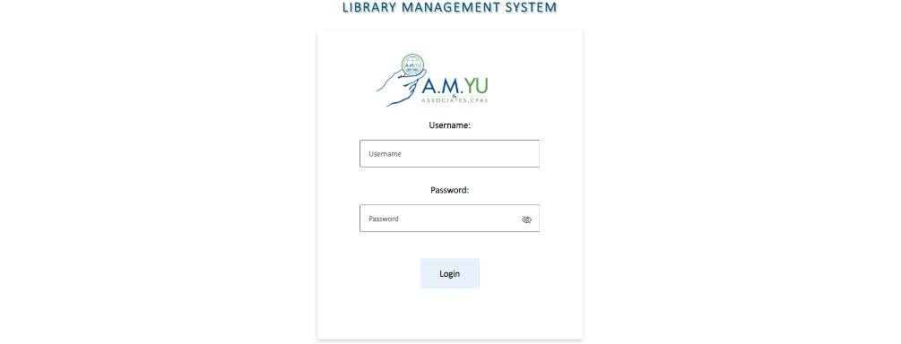
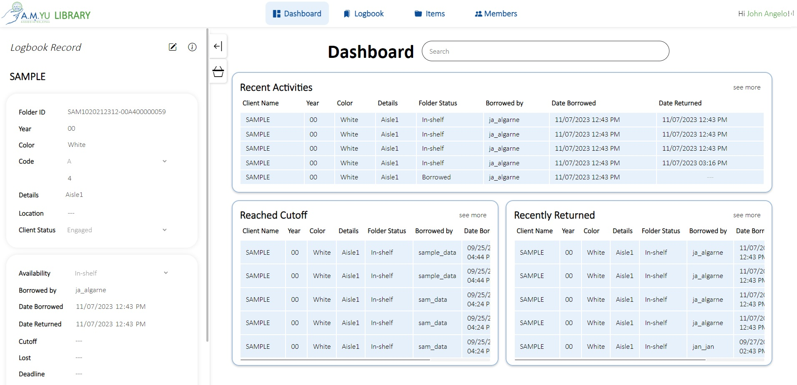
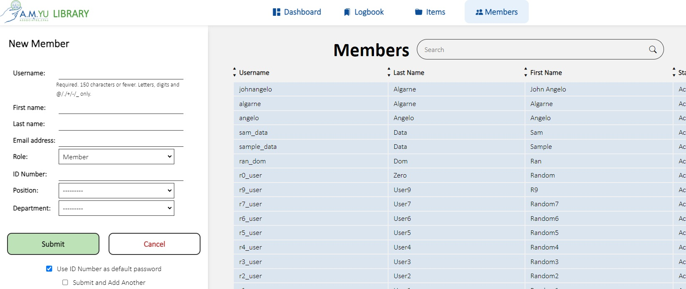
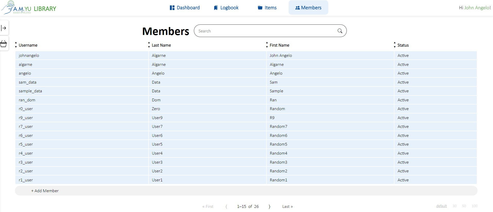
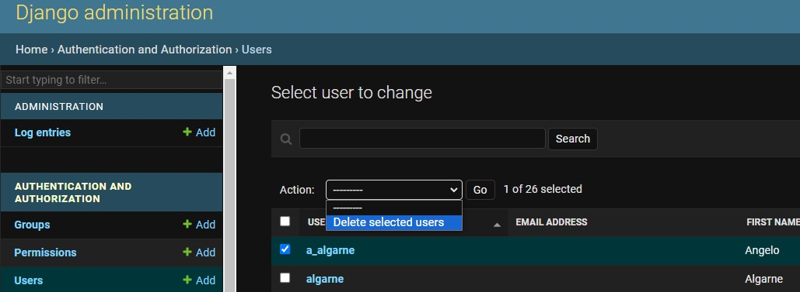
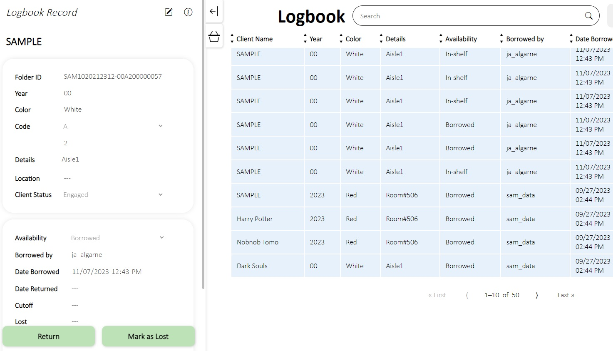
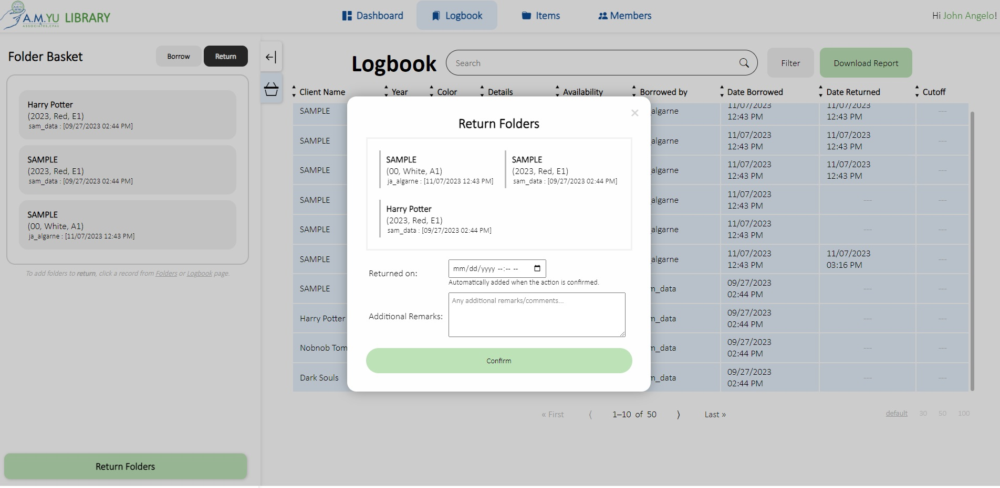

This repository showcases **_Library Management System (LMS)_**, my professional project for [A.M.Yu & Associates](https://www.amyucpas.com/).
# Introduction
The LMS is a web application built using Django Framework (with jQuery) and uses the PostgreSQL database, which includes basic CRUD functions. A local Linux server hosts the database and the web app (served by apache2 in Ubuntu).

The main purpose of the LMS is to automate a logbook system for internal purposes. Information such as "what item was borrowed", "when it was borrowed or returned", and "who borrowed it", are all stored to track the statuses of each item easily. 

_Note that the screenshots below are using sample data only._
# Video Demonstration
For quick reference, a [video demonstration](https://youtu.be/lsCTQvj9PCE) can be watched to highlight the user interface of the LMS.
# Features
The LMS has various features that allow users to view and manage data. It is tailored to the company's standards, so there are additional displayed columns. A key feature that is largely being used is the barcode function. Some of the features can be seen below in the following subsections.
## Login page
A login function is implemented to authenticate each user session.

## Dashboard
The Dashboard page is present to summarize the recent changes in the logbook.

## CRUD
**Create**: Adding new members that may access the LMS, or even new items that are to be borrowed, can be done by librarians.

**Read**: Each page reads the most important tables to display. For example, the Members page shows all the users that have an account for the LMS.

**Update**: A record can be edited via the side panel by librarians.

**Delete**: Since deleting records is highly discouraged, only the superusers/admins can delete a record using the Django Admin Panel.

## Side Panel
The side panel holds most of the main functions of LMS. Clicking a record from the tables or search results will open the record's details on the side panel. 

Most importantly, functions such as borrowing, returning, editing, or even borrowing/returning-in-bulk (Basket function), can all be done in the side panel as well.

# Obsidian
This repository is handled through [Obsidian](https://obsidian.md/), a note-taking software application that operates on Markdown files. A community plugin called **Obsidian Git** is installed to manage the content of this markdown file. Check out the official plugin on [this page](https://github.com/denolehov/obsidian-git).
# Inquiries
If you wish to contact me regarding this project, you may do so by messaging me on LinkedIn ([in/johnangeloalgarne](https://www.linkedin.com/in/johnangeloalgarne/)).
